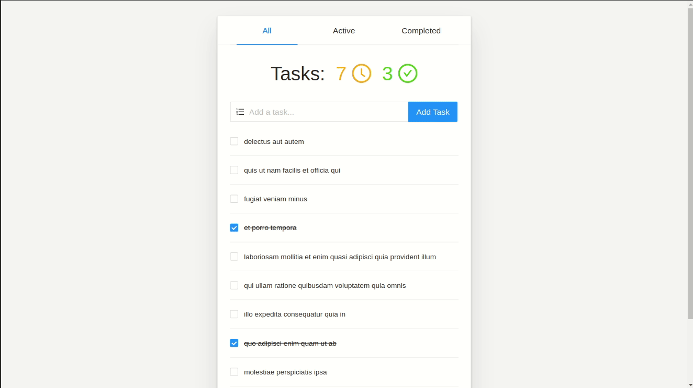

## Simple Todo List (CRA + Redux-toolkit)

Live Demo: [Sandbox]()

## Steps to run this project locally:

### `git clone https://github.com/kevinnhansenn/simple-todo.git`

First clone my public repository (make sure you have installed Git on your local machine)

### `yarn`

Install all the dependencies needed for this project.

### `yarn start`

Runs the app in the development mode. 
Open [http://localhost:3000](http://localhost:3000) to view it in the browser.

The page will reload if you make edits. 
You will also see any lint errors in the console.
